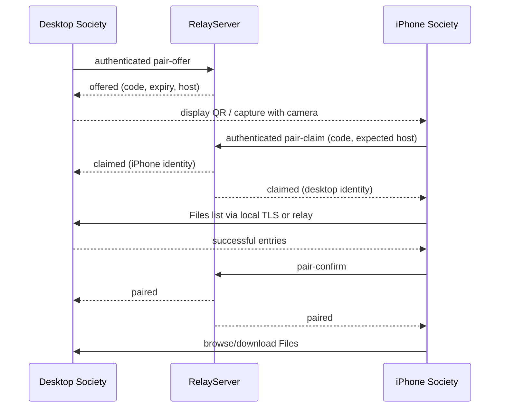

# 데스크톱과 iPhone QR 페어링

Society의 QR 페어링은 같은 iisacc 계정으로 로그인한 iPhone에서 데스크톱의 Files 호스트를 선택하고 연결을 확인하는 절차이다. 데스크톱은 코드를 표시하고 iPhone은 앱 안의 카메라로 읽는다. 단순 QR 인식이 아니라 실제 호스트의 Files 목록 응답과 중계 서버의 완료 통지까지 성공해야 양쪽에 완료를 표시한다.

## 사용 절차

1. 데스크톱과 iPhone Society에 같은 iisacc 계정으로 로그인한다. PC 2대·태블릿 2대·휴대폰 2대의 기존 독립 한도를 적용한다.
2. 데스크톱에서 컨테이너를 열고 Devices에 신뢰하는 Society 중계 주소를 설정한다. **Pair iPhone**을 누르면 호스트 모드로 연결하고 QR과 남은 시간을 표시한다.
3. iPhone에서 **Devices → Pair desktop → Scan QR code**를 누른다. 최초에는 카메라 사용을 허용하고 데스크톱 QR을 비춘다. 권한을 거부했다면 **Open camera settings**로 설정을 연다.
4. 양쪽에 상대 기기와 연결 확인 중 상태가 나타난다. iPhone이 호스트 Files 목록을 확인한 뒤 양쪽에 완료가 나타난다.
5. iPhone의 **Open host Files**로 폴더를 탐색하거나 파일을 내려받는다. 데스크톱의 **Done**은 QR 창을 닫는다.

최초 QR 수명은 최대 60초이며 인증의 남은 수명에 따라 더 짧다. 카메라가 읽은 뒤 확인 단계는 최대 15초이다. 만료·재사용·다른 계정·연결 중단은 완료로 처리하지 않는다. 데스크톱에서 **Show new QR code**로 재발급하면 이전 코드는 즉시 무효화된다. 창을 닫아도 진행 중인 요청은 취소된다. 너무 자주 시도하면 30초 후 재시도 안내를 표시한다.

## 구성과 데이터 흐름

| 파일/객체 | 책임 |
| --- | --- |
| `PairingPanel.qml` | LVRS 공통 화면, 코드·남은 시간·로그인·스캔·오류·완료·파일 열기 |
| `DevicePairing` | 기존 NetworkDriveController를 참조하여 발급·스캔·접속·Files 확인·완료·취소 상태를 관리 |
| `PairingQr` | Nayuki의 QR 행렬을 흰 여백 4모듈과 정수 배율로 표시 |
| `QrScanner` / `IosQrScanner.mm` | iOS 카메라 권한, AVFoundation QR 감지, 취소·중단·오류 처리 |
| `iiServerHost::PairingLink` | 버전 1 Society QR 링크의 생성과 엄격한 파싱 |
| `iiServerHost::Peer` / `RelayServer` | 인증된 WebSocket 발급·claim·confirm, 일회성 코드·계정·호스트 검증, 양쪽 완료 통지 |



`society://pair?v=1&relay=...&host=...&code=...`에는 중계 주소, 호스트 ID, 일회성 코드만 포함한다. 비밀번호·이메일 인증코드·로그인 쿠키·계정 데이터 모델은 QR에 포함하지 않는다. 서버는 32바이트 OS 무작위 코드의 SHA-256만 메모리에 보관하고 claim 때 소비한다. 취소·재발급·만료·인증 실패·호스트 해제·연결 종료 시 관련 대기를 제거한다. 필드 중복, 잘못된 버전, 비정상 코드, 사용자정보·query가 있는 relay 주소, loopback 밖의 평문 WS를 거부한다.

iPhone은 QR의 relay가 **이미 독립적으로 설정한 중계 주소**와 정확히 일치하는지 검사한다. 별도 설정이 없으면 계정 서비스의 HTTPS host·port와 일치하는 WSS만 허용한다. 임의 QR 서버로 iisacc 세션을 보내지 않는다. 다른 도메인에서 운영하는 정당한 중계는 Devices에 먼저 설정해야 한다. 계정 검증은 기존 SessionAuthenticator가 고정된 iisacc `/Account/Session`을 사용한다. 인증 성공한 같은 계정·같은 서비스의 호스트만 선택할 수 있다.

완료 시 iPhone 로컬 설정에는 계정 ID와 중계 URL의 해시로 구분한 호스트 ID·표시 이름만 저장한다. QR과 인증정보는 저장하지 않는다. 다음 연결에서 해당 범위의 호스트가 실제 목록에 나타나면 다시 선택한다. 다른 계정이나 다른 중계의 동일한 ID는 자동 선택하지 않는다. 영구 오프라인 권한을 발급하는 기능은 아니며 계정 세션과 중계 연결은 계속 필요하다. 기존 같은 계정의 Devices 목록 접근 정책도 유지한다.

## 카메라와 의존성

QR 내부의 중계 URL은 중첩 인코딩하여 경로의 `%2F`·`%25` 같은 이스케이프를 보존한다. 패널은 QR·로그인 안내·완료 등 현재 내용의 높이에 맞추고 작은 창에서는 스크롤한다. 자동 검사는 최종 화면의 QR 해독과 완료 버튼의 닫기 동작도 확인한다.

카메라는 Apple AVFoundation의 `AVCaptureMetadataOutput`에서 QR만 감지한다. 마이크를 구성하지 않으며 사진·영상 파일을 만들거나 업로드하지 않는다. 앱이 background/hidden으로 전환되거나 창을 닫으면 카메라를 종료한다. 시스템 권한 대화상자의 Inactive 상태는 카메라 취소로 처리하지 않는다. 스캔은 현재 iPhone/iPad에서 제공하며 Android 카메라 스캐너는 포함하지 않는다.

QR 생성은 [Project Nayuki](https://www.nayuki.io/page/qr-code-generator-library)의 C++ 라이브러리를 사용한다. 추가 전이 의존성이 없는 MIT 소스를 커밋과 SHA-256으로 고정했다. 출처·라이선스·갱신 절차는 `ThirdParty/qrcodegen/README.md`에 있으며 라이선스 원문을 앱의 `:/licenses/qrcodegen/LICENSE`에도 포함한다. 자체 QR 알고리즘이나 암호 구현을 추가하지 않는다. Apple API 근거는 [AVCaptureMetadataOutput](https://developer.apple.com/documentation/avfoundation/avcapturemetadataoutput)과 [카메라 접근 요청](https://developer.apple.com/documentation/avfoundation/avcapturedevice/requestaccess(for:completionhandler:))이다.

## 검증과 운영 조건

앱 QML 모듈은 `DEPENDENCIES QtQuick`을 명시해 C++의 `QQuickPaintedItem` 기반 QR 타입을 정적 검사에서도 해석하게 한다. 앱 구성과 실행은 기존 LVRS의 `lvrs_configure_qml_app`과 bootstrap을 유지한다. 의존성 선언은 [Qt 공식 CMake 계약](https://doc.qt.io/qt-6.8/qt-add-qml-module.html#declaring-module-dependencies)을 따른다.

`Society.Pairing`은 실제 RelayServer·Peer·임시 Society 컨테이너를 사용한다. 생성한 QR 이미지를 macOS CoreImage의 독립 QR 판독기로 읽고, 로컬과 원격 전송 각각에서 페어링·Files 목록·파일 바이트 다운로드까지 확인한다. 코드 재사용, 실패한 Files 확인, 임의 QR relay로의 인증정보 전송 차단, 계정·중계 범위의 재접속과 1120×720·390×844·640×360 패널을 검사한다. `Society.ClientOnlyNetwork`는 모바일 분기에서 Pair desktop 진입, 로그인 안내, 로그인 후 스캔 버튼, 호스트 코드 발급 차단을 검사한다. SDK의 `iiServerHost.pairing`과 설치 소비자 검사는 서버의 계정 격리·소모·confirm·취소·만료·제한을 검증한다.

```sh
cmake --build build/account-integration --parallel 4
ctest --test-dir build/account-integration --output-on-failure
cmake --build build/account-integration --target Society_qmllint
python3 -B tools/build_ios.py --platform ios-device --team <team-id>
python3 -B tests/verify_ios_bundle.py build/ios-device/bin/Debug/Society.app --device <device-udid>
```

운영에서 사용하려면 배포된 iisacc 네이티브 계정 API와 iiServerHost 0.3.0 중계의 WSS 주소가 필요하다. 중계 실행과 TLS 구성은 SDK README 및 [NetworkDrive.md](NetworkDrive.md)를 따른다. 새로운 유료 인프라를 생성하거나 운영 주소를 임의로 기본값에 넣지 않았다. 코드·통합 테스트·서명 빌드 성공은 실제 계정 로그인, 공용 중계 배포, iPhone 카메라로 데스크톱 화면을 촬영한 현장 검증을 대신하지 않는다.

### 2026-09-09 검증 기록

| 검사 | 결과와 증거 |
| --- | --- |
| Society 전체 회귀 | CTest 14/14 통과, `build/pairing-release-tests.log` |
| iiServerHost 및 설치 소비자 | 각각 CTest 4/4 통과, SDK `build/pairing-final-test.log`, `build/pairing-consumer-test.log` |
| QML 정적 검사 | 경고 없이 통과, `build/pairing-qmllint.log` |
| macOS 네이티브 QR | Apple M1 Max Metal 렌더링, 실제 창 QR 해독·완료 버튼, 3개 크기 모두 통과. `build/pairing-native-ui.log`, `build/pairing-desktop.png` |
| 실제 macOS 앱 | Storage → Devices → Pair iPhone → 계정 화면 전환을 실제 창에서 확인 |
| iOS | arm64 서명 빌드, App Group·프로비저닝·AVFoundation·카메라 목적·라이선스 검증 통과. 연결된 iPhone 15 Pro Max에 설치·전경 실행 후 Society 및 File Provider 프로세스 확인. `build/pairing-ios-bundle.json`, `build/pairing-ios-install.json`, `build/pairing-ios-launch.json` |
| Android 호환성 | arm64 Release APK 빌드 통과, `build/android/app/android-build/Society.apk`. 이번 변경의 Android 카메라 스캔은 제공하지 않음 |
| 운영 로그인 API | 인증정보 없는 `GET https://iisacc.com/Account/Session/App`가 HTTP 404를 반환함. `build/pairing-account-api-status.json` |

실제 iisacc 계정의 iPhone 로그인, 공용 중계 배포 및 iPhone 카메라로 모니터의 QR을 촬영하는 전체 현장 절차는 검증하지 않았다. 이를 위의 로컬 통합 검사나 설치 성공으로 대체하여 완료로 보고하지 않는다.
