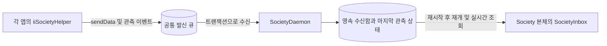

# SocietyDaemon

Society 창과 별도 수명을 갖는 사용자 세션의 수신 서비스이다. 모든 iiSocietyHelper 0.3.0 참여자가 남긴 데이터를 받아 영속 수신함에 보관한다. Society 본체는 나중에 실행해도 데이터를 읽고, 실행 중에는 새로운 데이터를 계속 전달받는다.



## 수명과 데이터 보장

- Helper와 데몬 모두 같은 `SOCIETY_HELPER_DIRECTORY` 또는 플랫폼 기본 위치를 사용한다. 데이터는 그 아래 `delivery/delivery.sqlite`에 기록한다. Society 콘텐츠 드라이브의 Files/·Models/에는 넣지 않는다.
- 데몬은 창이 없는 Qt Core 실행 파일이다. 단일 소유자 잠금으로 같은 저장 위치에 두 데몬이 수신을 수행하지 못하게 한다. 강제 종료 후 새 프로세스가 잠금을 회수한다.
- 250 ms마다 최대 128개 메시지를 수신하고, 1초마다 또는 관측 목록 변경 시 마지막 상태를 저장한다. 이는 OS 스케줄링과 저장 장치 응답에 따른 지연이 있는 폴링 주기이다.
- SQLite 트랜잭션으로 outbox → inbox 이동과 발신 제거를 함께 커밋한다. 오류나 중단이 발생하면 발신 데이터를 남기며 재처리한다. 같은 메시지 ID를 수신함에 중복 저장하지 않는다.
- 본체가 닫히면 데몬은 계속 실행된다. 데몬도 꺼져 있으면 Helper 발신 큐에 저장되며 데몬 재시작 후 수신한다. 이미 수신된 데이터는 데몬 없이도 본체가 읽을 수 있다.
- 본체의 `societyInbox` 컨텍스트 객체는 `dataReceived`, `messages`(최근 100개), `readAfter`, `lastSequence`, `acknowledge`를 제공한다. 전체 기록은 페이지로 다시 읽을 수 있다.
- ACK는 앱의 업무 처리가 끝난 뒤 명시적으로 한다. 자동 ACK하지 않으며, 처리 확인 전 앱 재실행은 같은 메시지를 다시 전달할 수 있다. 수신함 자체는 자동 삭제하지 않는다.
- 마지막 데몬 스냅샷은 마지막 기록 시점의 상태이다. 현재 실행 여부는 Helper의 생존 관측 또는 OS 서비스 상태로 확인한다. 앱 ID는 협력 앱이 선언하는 식별자이며 인증 기능은 아니다.

외부 메시지 브로커나 새 데이터베이스 서버를 도입하지 않는다. 기존 Qt 6.8.3의 Sql/QSQLITE와 SQLite WAL·FULL 동기화를 사용한다. 직접 파일 저널과 복구 프로토콜을 구현하는 것보다 기존 트랜잭션을 이용하는 편이 유지보수 부담이 낮다. Qt·SQLite의 라이선스는 사용 중인 Qt 배포본을 따른다.

## macOS 백그라운드 등록

Society.app 안에 다음 두 파일을 포함한다.

- `Contents/Helpers/SocietyDaemon.app/Contents/MacOS/SocietyDaemon`
- `Contents/Library/LaunchAgents/com.iisacc.society.daemon.plist`

SMAppService의 LaunchAgent로 등록한다. 시스템 전체 root 데몬이 아닌 현재 로그인 사용자의 서비스이므로 같은 사용자의 Helper 저장 위치를 사용한다. 등록이 활성화되면 창 종료 후에도 실행하고 다음 로그인 시 다시 시작하며, 종료되면 launchd가 다시 가동한다. 실행 파일은 앱 번들 상대 경로를 사용한다. 외장 드라이브의 앱 번들이 접근 가능해야 한다.

일반 Society 실행 시 등록을 시도한다. `SOCIETY_HELPER_DIRECTORY`가 명시된 격리 실행은 사용자 로그인 서비스를 바꾸지 않는다. 명령행에서도 등록 상태를 관리할 수 있다.

```sh
build/package/Society.app/Contents/MacOS/Society --daemon-service status
build/package/Society.app/Contents/MacOS/Society --daemon-service register
build/package/Society.app/Contents/MacOS/Society --daemon-service unregister
```

반환 JSON의 `status`는 enabled/requires-approval/not-registered/not-found/unsupported 중 하나이다. 등록 결과와 실제 데몬의 실행은 별도로 확인한다. macOS가 백그라운드 항목 승인을 요구하면 그 상태를 반환하며 성공으로 보고하지 않는다. 창을 닫는 것은 서비스를 해제하지 않는다.

SMAppService는 서명된 번들을 요구한다. 데몬의 Qt·Helper·SQLite 드라이버도 앱 번들에 포함해야 한다. 외장 볼륨에 있는 개발용 SDK를 직접 참조하면 launchd가 데몬을 시작해도 macOS의 외장 볼륨 접근 처리에서 라이브러리 로딩이 대기할 수 있다. 등록된 바이너리나 plist를 갱신할 때에는 기존 서비스를 해제하고 패키징한 뒤 다시 등록해야 한다.

```sh
build/package/Society.app/Contents/MacOS/Society --daemon-service unregister
cmake --build build --target SocietyDaemonPackage
/System/Library/Frameworks/CoreServices.framework/Frameworks/LaunchServices.framework/Support/lsregister -f "$PWD/build/package/Society.app"
build/package/Society.app/Contents/MacOS/Society --daemon-service register
```

`SocietyDaemonPackage`는 기존 Qt의 macdeployqt로 `build/package/Society.app`의 데몬에 필요한 Core·Sql·Helper·SQLite 드라이버를 포함한다. `SOCIETY_MAC_SIGN_IDENTITY` CMake 설정으로 키체인의 서명 인증서를 지정하며 기본값 `-`는 ad-hoc이다. 데몬 실행 파일을 먼저 서명하고 본체 번들을 마지막에 서명한다. macOS 버전과 서명 상태에 따라 ad-hoc 패키지는 등록 후 실행 제약에 실패할 수 있으므로 실제 수신 여부를 확인한다. 본체 GUI는 현재 개발 SDK 링크 경로를 유지하며, 이 대상은 전체 GUI 앱의 독립 배포·공증을 대신하지 않는다. 로컬 검증용 패키지는 보안 타임스탬프를 요청하지 않는다. 패키징 검증은 실제 데몬의 번들 밖 비시스템 라이브러리 로딩 여부와 SQLite 드라이버의 번들 내부 링크를 검사한다. 수신·종료·복구는 데몬 테스트와 실제 로그인 서비스 실행으로 별도 검증한다.

데몬은 별도 `Contents/Helpers/SocietyDaemon.app` 안의 Frameworks·PlugIns를 사용한다. 본체 GUI가 데몬의 SQL 플러그인을 발견해 Qt 런타임을 두 벌 로딩하지 않도록 저장 위치도 분리한다. 본체의 기존 라이브러리 연결을 보존하는지 검사하며, 데몬 소스만 변경해도 본체 번들에 새 실행 파일이 복사되도록 빌드 의존성을 연결한다.

위 갱신 예시는 기존 패키지가 등록된 경우이다. 최초 설치에서는 해제 단계를 생략한다. 앱 위치나 서명·helper 구성을 변경한 개발 패키지는 해당 앱만 Launch Services에 다시 등록해 메타데이터를 갱신한다. 다른 앱의 백그라운드 설정을 초기화하지 않는다.

## 진단과 플랫폼

macOS 또는 다른 데스크톱에서 창 없이 직접 실행할 수 있다. 생성물은 build/ 아래에 둔다.

```sh
build/SocietyDaemon --directory "$PWD/build/daemon-verification"
```

`--exit-after-ms 15000`은 유한 시간의 진단 실행에 사용한다. SIGTERM/SIGINT는 이벤트 루프에서 정상 종료하고, SIGKILL 뒤에도 수신함과 미처리 발신 큐가 남는다. Qt 로그 범주는 `iisacc.society.daemon`, `iisacc.society.inbox`, `iisacc.society.helper`이며 메시지 ID·앱 ID·토픽을 기록하고 사용자 payload는 로그에 출력하지 않는다.

iOS는 독립 상주 데몬을 지원하지 않는다. 동일한 Society App Group의 Application Support 안에 발신 데이터를 보관하고, Society 앱이 실행되는 동안 `SocietyDaemonService`로 수신한다. `SocietyRuntime`은 중단 때 Helper의 마지막 이벤트를 기록하고 수신기 잠금·DB 연결을 해제한다. 복귀 때 영속 ACK를 복원하여 누적 데이터를 수신하고, 실행 중 시작 실패도 재시도한다. Inactive는 파일 선택기에서도 발생하므로 중단으로 취급하지 않는다. 호스트의 `Society.MobileLifecycle`이 이 복구 경로를 검증한다. 실제 iOS 빌드·기기 검증 상태는 [iOS 구현 문서](iOS.md)를 따른다. Android 앱 간 저장 위치와 Windows/Linux 로그인 서비스 등록은 아직 별도 구현 대상이다. 현재 서비스 등록과 프로세스 실행 검증 대상은 macOS이다.

## 검증

`Society.Daemon`은 단일 데몬 잠금, 본체 실행 전의 데이터 보관, 늦게 시작한 수신 객체, 처리 확인, 실제 프로세스 강제 종료·재시작, 본체 실행 파일의 과거 데이터 수신, 본체 종료 후 데몬 생존을 검사한다. SDK의 delivery 테스트는 수신 실패 트랜잭션 롤백, 순번 페이지 읽기와 확인 위치도 검증한다. 테스트는 모두 build/ 안에 격리하고 실제 사용자 로그인 서비스를 등록하지 않는다.

근거: [SMAppService](https://developer.apple.com/documentation/servicemanagement/smappservice), [등록과 다음 로그인 실행](https://developer.apple.com/documentation/servicemanagement/smappservice/register()), [Qt SQL 드라이버](https://doc.qt.io/qt-6.8/sql-driver.html), [SQLite WAL](https://sqlite.org/wal.html), [iOS 백그라운드 실행](https://developer.apple.com/documentation/xcode/configuring-background-execution-modes).
